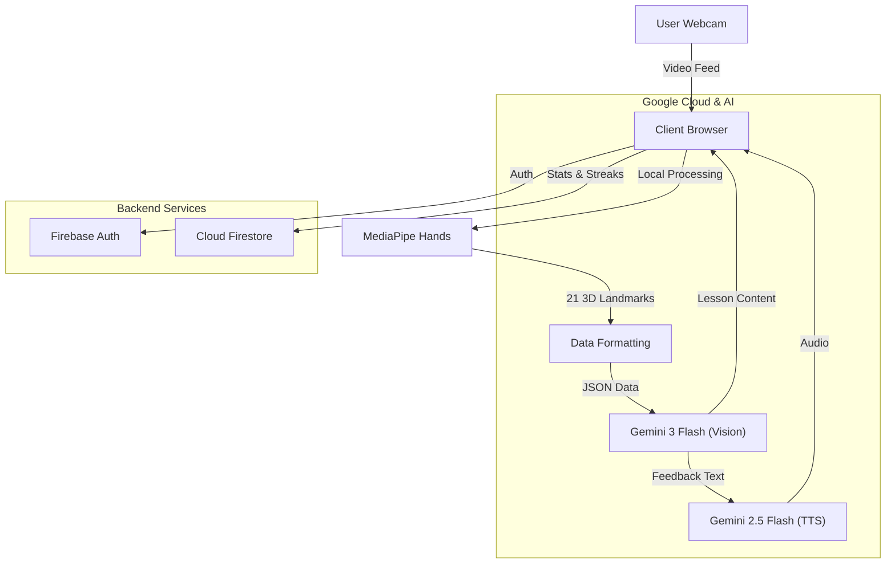

<p align="center">
  
  
  
</p>

<p align="center">
  
  
  
  
  
</p>

<p align="center">
  
</p>

<p align="center">
  <b>The Future of Sign Language Education</b><br/>
  Interactive, Accessible, and Powered by Next-Gen AI
</p>

<p align="center">
  
</p>

# 🖐️ Signify

**Signify** is an innovative, gamified education platform designed to make learning **American Sign Language (ASL)** accessible, interactive, and effective. By leveraging advanced webcam-based hand tracking and state-of-the-art Generative AI, Signify provides a **"Live Tutor"** experience that watches you sign and offers instant, personalized corrections—just like a real teacher.

---

## 🚨 Problem Statement

Traditional ASL learning methods—videos, diagrams, and flashcards—lack feedback. Learners often struggle to know if they are performing signs correctly, leading to frustration and slow progress. Private tutors are effective but expensive and not scalable.

---

## 🧠 Solution Overview

Signify bridges this gap by using **Google MediaPipe** for real-time hand tracking and **Google Gemini** for semantic analysis.

- **See**: The app visualizes your hand skeleton in real-time.
- **Analyze**: Gemini checks your hand shape, orientation, and motion.
- **Speak**: The AI tutor speaks corrections naturally to guide you.

---

## 🏗️ System Architecture



---

## ✨ Key Features

### 📷 Real-Time Hand Tracking

- Utilizes **Google MediaPipe** for instant, client-side skeletal tracking (30+ FPS).
- Visualizes hand landmarks on screen for immediate visual feedback.
- **Privacy-First**: Raw video is processed locally; only anonymous landmarks are analyzed.

### 🤖 AI-Powered Live Tutor

- **Vision Analysis**: **Gemini 3 Flash** evaluates your exact hand shape against the correct ASL sign.
- **Natural Voice**: **Gemini 2.5 Flash TTS** speaks corrections (e.g., "Tilt your palm more towards the camera").
- **Granular Feedback**: Detects subtle errors like thumb tucking or finger spacing.

### 📚 Smart Curriculum

- **Static Lessons**: Master the ASL Alphabet (A-Z) with guided practice.
- **Dynamic Phrases**: Learn fluid motions for words like "Hello" and "Thank You".
- **AI Lesson Generator**: Type _any_ word, and Gemini instantly creates a custom lesson plan.

### 🔥 Gamification & Progress

- **Daily Streaks**: Keep your learning habit alive.
- **Quota Tracker**: Visual indicators for daily AI usage limits.
- **Smart History**: Track your improvements over time.

---

## 🧰 Tech Stack

### 🌐 Frontend

- **React 19** (Latest standard)
- **Vite** (Build tool)
- **Tailwind CSS** (Styling)
- **Framer Motion / GSAP** (Animations)

### ⚙️ Google Integration

- **Google Gemini 3 Flash**: Primary reasoning & vision model.
- **Gemini 2.5 Flash**: Text-to-Speech generation.
- **Google MediaPipe**: Computer vision & hand tracking.
- **Firebase**: Authentication & Database.

### 🚀 Deployment

- **Vercel**: Optimized edge deployment.

---

## 🚀 Getting Started

### Prerequisites

- Node.js 18+
- Google Gemini API Key
- Firebase Project Credentials

### Installation

1.  **Clone the Repository**

    ```bash
    git clone https://github.com/Hackmaass/Signify_.git
    cd Signify_
    ```

2.  **Install Dependencies**

    ```bash
    npm install
    ```

3.  **Configure Environment**
    Create a `.env` file in the root directory:

    ```env
    VITE_GEMINI_API_KEY=your_gemini_api_key
    VITE_FIREBASE_API_KEY=your_firebase_key
    VITE_FIREBASE_AUTH_DOMAIN=your_project.firebaseapp.com
    VITE_FIREBASE_PROJECT_ID=your_project_id
    VITE_FIREBASE_STORAGE_BUCKET=your_bucket
    VITE_FIREBASE_MESSAGING_SENDER_ID=your_sender_id
    VITE_FIREBASE_APP_ID=your_app_id
    ```

4.  **Run Locally**
    ```bash
    npm run dev
    ```

---

## 👥 Team

| ⚡ Team Daemons      |
| :------------------- |
| **Omkar Rane**       |
| **Saee Kumbhar**     |
| **Bhavjot Singh**    |
| **Prathamesh Patil** |

---

## 🤝 Contributing

Contributions are welcome! Please open an issue or submit a pull request.

1. Fork the repo.
2. Create your feature branch (`git checkout -b feature/AmazingFeature`).
3. Commit your changes.
4. Push to the branch.
5. Open a Pull Request.

---

<p align="center">
  <i>Built with for Cyberathon</i>
</p>
